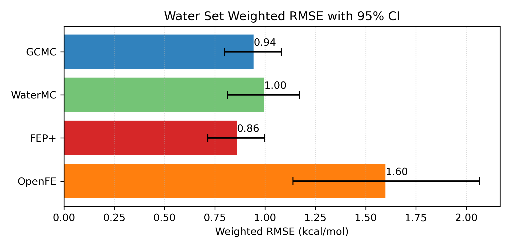
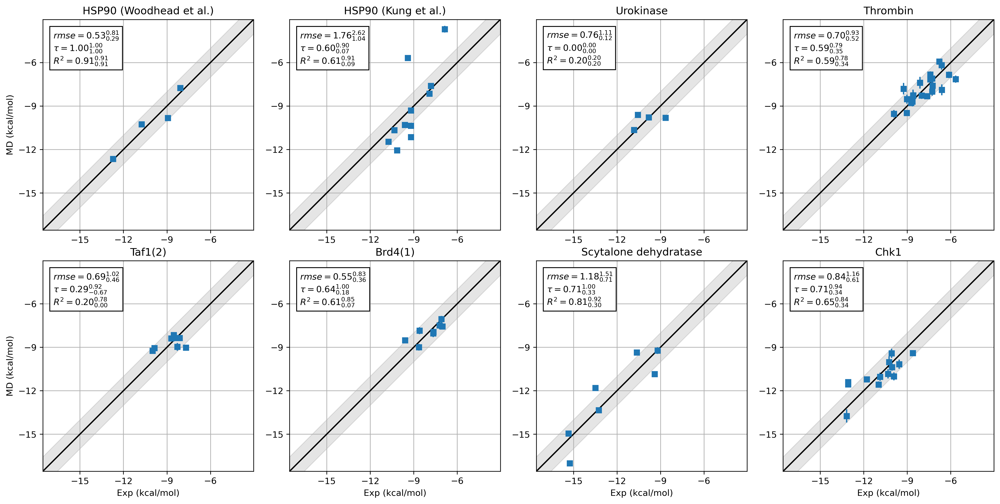
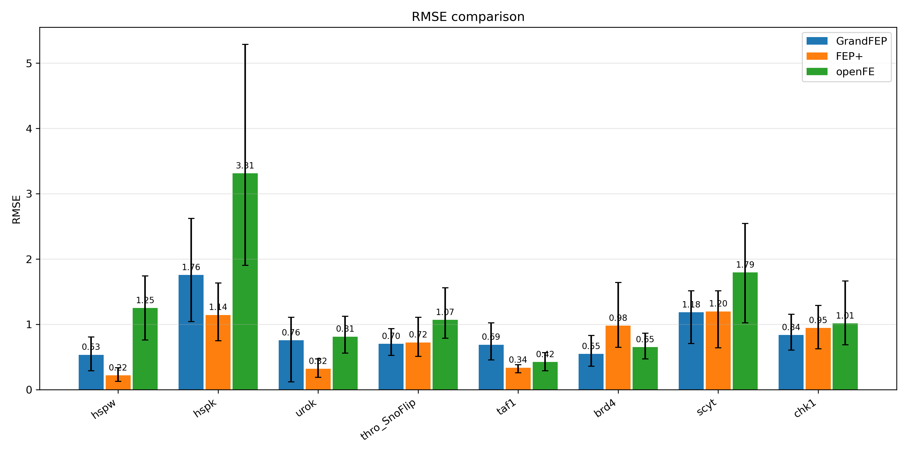

# GrandFEP
## 1. Quick Installation
### 1.1 Prepare Env
```bash
mamba env create -f env.yml # edit cuda and MPI according to your cluster
mamba activate grandfep_env
pip install .
```

### 1.2 Later on the cluster
```bash
source /home/NAME/SOFTWARE/miniforge3/bin/activate grandfep_env
module add openmpi4/gcc/4.1.5 # only as an example
which mpirun                  # check if the correct mpirun is used
```

## 2. GrandFEP is doing as good as FEP+





## 3. Full Documentation
[huichenggong.github.io/GrandFEP](https://huichenggong.github.io/GrandFEP/)

## 4. Contact
Chenggong Hui  
<chenggong.hui@mpinat.mpg.de>  
<huicgx@126.com>  
