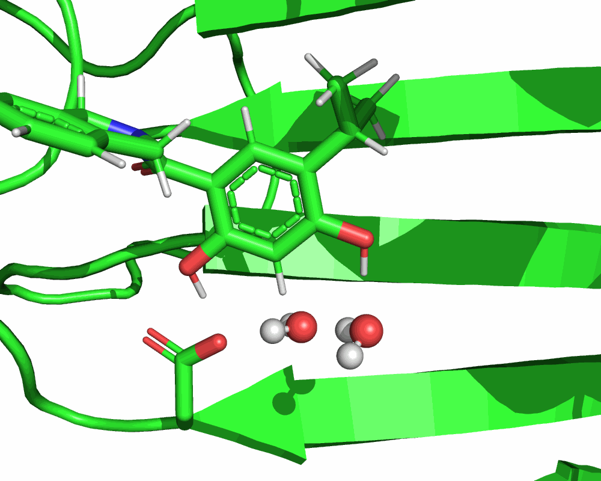
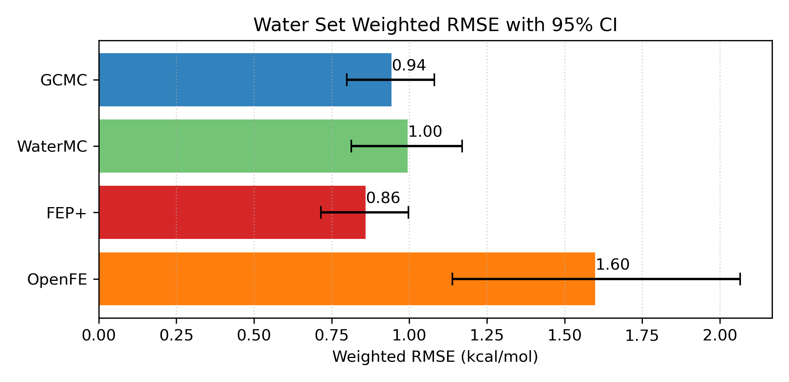
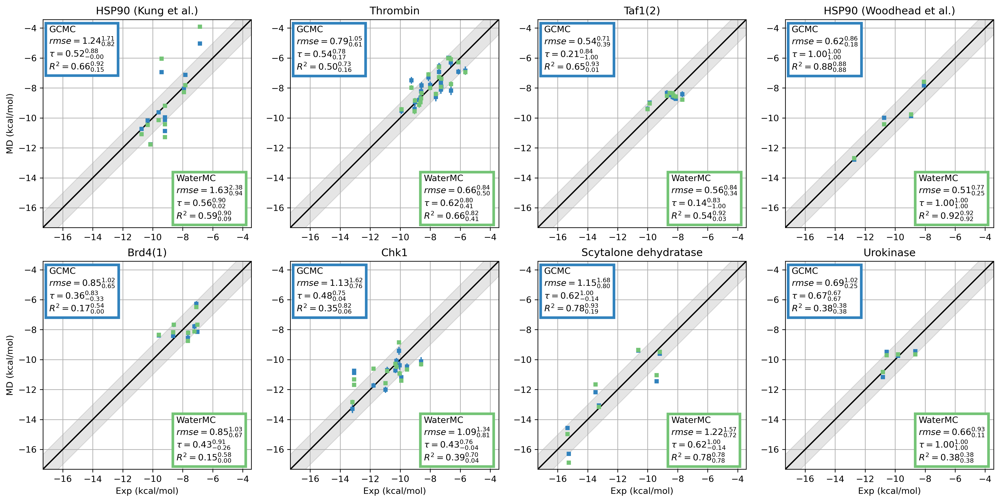
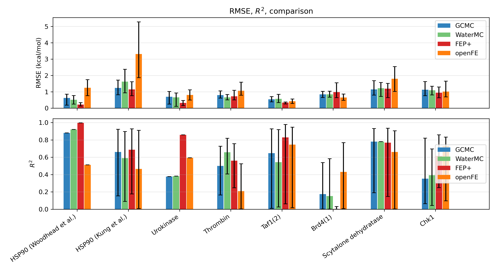

# GrandFEP

GrandFEP is a Python library for **relative binding free energy (RBFE)** calculations that explicitly enhances water sampling. It combines **Grand Canonical Monte Carlo (GCMC)**, **Water-Swap Monte Carlo (Water MC)**, **Replica Exchange Solute Tempering (REST2)**, and **Terminal-Flip Monte Carlo (TFMC)** on top of [OpenMM](https://openmm.org/), enabling water molecules to be inserted and deleted during the simulation so that water occupancy differences between ligand pairs are captured correctly.

**Key features:**
- Alchemical water swap moves (WaterMC) for moving water between the active site and bulk using nonequilibrium candidate Monte Carlo (NCMC)
- Alchemical water insertion/deletion (GC ensemble)
- REST2 enhanced sampling for ligand and protein degrees of freedom
- Terminal-Flip MC for enhanced sampling of terminal groups dihedrals



## 1. Quick Installation
### 1.1 Prepare Env
```bash
mamba env create -f env.yml # edit cuda and MPI according to your cluster
mamba activate grandfep_env
pip install .
```

### 1.2 Later on the cluster
```bash
source /home/NAME/SOFTWARE/miniforge3/bin/activate grandfep_env
module add openmpi4/gcc/4.1.5 # only as an example
which mpirun                  # check if the correct mpirun is used
```

## 2. GrandFEP Sampling Performance

### 1) Overall performance (weighted RMSE, 95% CI)
<p align="center">
  
</p>

**What this shows:** aggregated error across the full water set (lower is better).  
- GrandFEP (GCMC): **0.94** kcal/mol  
- GrandFEP (WaterMC): **1.00** kcal/mol  
- FEP+: **0.86** kcal/mol  
- OpenFE: **1.60** kcal/mol  

---

### 2) Per-target predictions (8 systems)
<p align="center">
  
</p>

**How to read:** each panel is one target; diagonal is perfect agreement; shaded band indicates 1 kcal/mol error region.

---

### 3) Accuracy and correlation by target (RMSE and R²)
<p align="center">
  
</p>

**What this shows:** target-by-target breakdown of error (RMSE) and correlation (R²), including bootstrapped 95% CI.

## 3. Full Documentation
[https://degrootlab.github.io/GrandFEP/](https://degrootlab.github.io/GrandFEP/)

## 4. Contact
Chenggong Hui  
<chenggong.hui@mpinat.mpg.de>  
<huicgx@126.com>  
