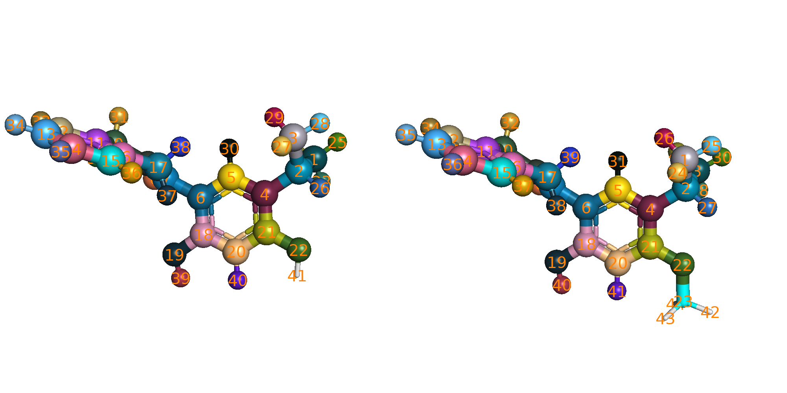

# Script  
Useful script for all kinds of tasks

## 1. Simulation Scripts
###  run_NPT_init.py
This script is for NPT density equilibration, no MPI.  

###  run_NPT_RE.py
This script is for NPT with replica exchange simulation, with MPI.  

###  run_GC_prep_box.py
This script is for preparing the box for grand canonical simulations. It takes a list of rst7 files and cut a new simulation box from those rst7 files. The extra volume will be converted to ghost water.  

###  run_GC_RE.py
This script is for grand canonical replica exchange simulation, with MPI.  

### run_NPT_waterMC_RE.py
This script is for NPT with water MC + replica exchange simulation, with MPI.

## 2. Preparation Scripts
Those scripts are used to prepare/convert files.  

### hybrid.py
Generate hybrid topology/openmm.System from state A and state B. State A/B are given in Amber prmtop/rst7 format.  

### pair_2_yml.py
Convert pair.dat (pmx AtomMapping output with 1-index) to a mapping.yml (0-index) file.

### color_map_pairs.py
Check the atom mapping of 2 ligands. Mapped atoms will be shown in sphere with matched color. pymol index is 1-based-index. This is a pymol script.  
```
pymol -d "run $script_dir/color_map_pairs.py; check_color_mapping lig1.pdb, lig2.pdb, pair.dat"
```


### fit_and_center.py
Load pdb and dcd files, fit and center the trajectory. This is a pymol script.  
```
pymol -d "run $script_dir/fit_and_center.py; fit_and_center ../../../system.pdb, gc_??_??.xtc"
```

### dcd_2_xtc.py
Convert DCD trajectory files to XTC format.  

### remove_ghost.py
Remove ghost atoms from the system, and convert DCD files to XTC file.

## 3. Analysis Scripts
### analysis/check_RE.sh
Check the number of exchanges between lambda replicas. Only rank 0 log the exchange information, so only need to check log file for window 0.
```bash
>>> $script_dir/analysis/check_RE.sh rep_?/0/0/gc.log
Log files: rep_0/0/0/gc.log rep_1/0/0/gc.log rep_2/0/0/gc.log
Max replica index in rep_0/0/0/gc.log is 15
   0  x   1  x   2  x   3  x   4  x   5  x   6  x   7  x   8  x   9  x  10  x  11  x  12  x  13  x  14  x  15  
    364    339    343    254    131    209    199    170    203    230    237    253    155    253    261
Minimum/Total exchange: 131/3601
```

### analysis/MBAR.py
Estimate free energy difference using MBAR/BAR method.
```bash
$script_dir/analysis/MBAR.py -log ?.dat ??.dat -kw "Reduced_E:" -m MBAR -csv mbar_dG.csv
```
