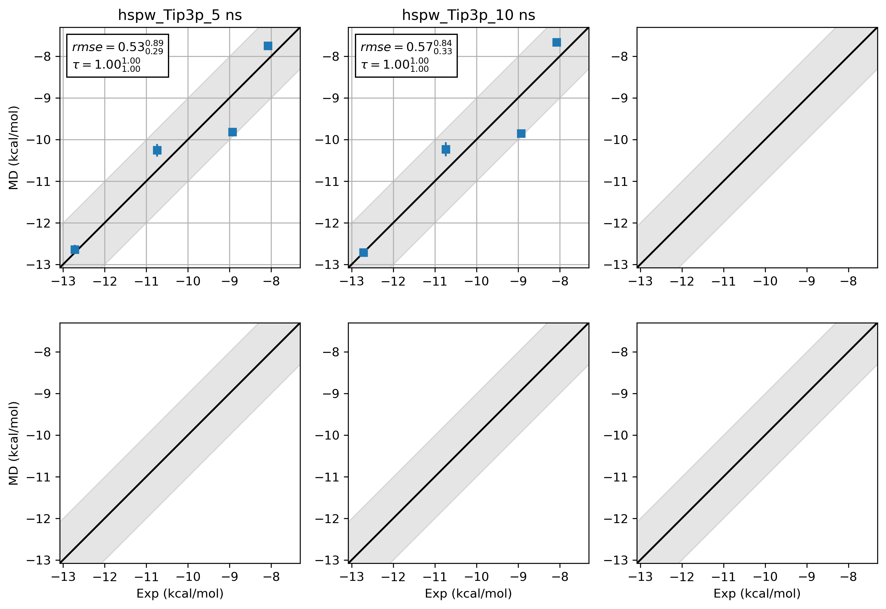
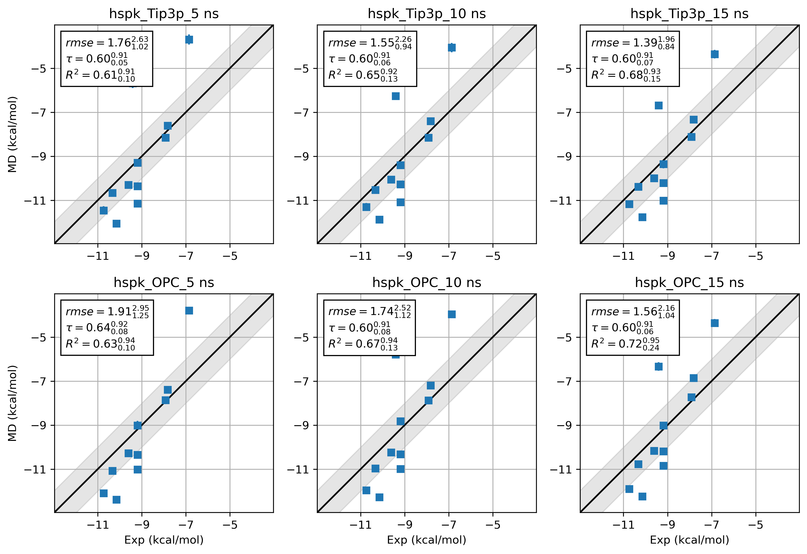

## 1. Introduction
This tutorial will use the hsp90 woodhead data set from Schrodinger. The input file is adapted from the paper of 
Ross et al.[1] The hsp90 woodhead data set shows significant improvement in sampling efficiency when using 
Grand Canonical Monte Carlo (GCMC) water sampling.  

## 2. Preparation
### 2.1. Environment setup
```bash
#!/usr/bin/env bash
mamba activate grandfep_dev
export script_dir="/GrandFEP_Gitdir/Script/"
```  
`GrandFEP_Gitdir` should be replaced by your `GrandFEP` git repository directory. The scripts under `Script/` will be used 
throughout the tutorial.  

### 2.2. Ligand preparation
```bash
# from the GrandFEP root directory
cd test/hspw_tutorial/lig_prep
```
All of the ligands have been prepared by `Antechamber`. `02.mol2` has the AM1-BCC charges and `03.frcmod` has the 
missing parameters. The Amber `tleap` script `04_tip3p_150mmol.in`, and the solvated water box 
`03_all_ligands_solvated.pdb` are also provided.  

```
./04_build_box.sh
```
After running `04_build_box.sh`, Amber top (`.prmtop`) and coordinate (`.inpcrd`) file will be generated in each ligand 
folder. Those files are : `07_tip3p.pdb`, `07_tip3p.prmtop`,`07_tip3p.inpcrd` for tip3p water and `08_opc.pdb`, 
`08_opc.prmtop`, `08_opc.inpcrd` for OPC water.  

### 2.3. Protein preparation
```bash
# from the GrandFEP root directory
cd test/hspw_tutorial/pro_prep
```
Files are provided.

### 2.4. Check atom mapping
The atom mapping is provided in each edge (`edge_LigX_to_LigY`) folder. You can visualize the mapping by excuting the 
following script.
```bash
# from the GrandFEP root directory
cd JOB/atom_mapping/
./run_check_all.sh
```
The pymol script `$script_dir/color_map_pairs.py` will be called to load and color the mapped atoms. Mapped atoms will 
have the same color showing in sphere.  


### 2.5. Hybrid system preparation
```bash
# from the GrandFEP root directory
cd test/hspw_tutorial/JOB/tip3p_REST2
./run_01_hybrid.sh
```
This will take a while. This script prepares the hybrid topologies (the `system` object in openmm), and save the 
`system` to a serialized file `system.xml.gz`. This can save time in the later simulations. Here is a quick explanation 
of the script for doing this hybrid system preparation.  
```bash
$script_dir/hybrid.py \
    -prmtopA A.prmtop \
    -inpcrdA A.inpcrd \
    -prmtopB B.prmtop \
    -inpcrdB B.inpcrd \
    -yml ../hybrid_map.yml \
    -pdb system.pdb \
    -system system.xml.gz \
    -REST2 \
    -dum_dihe_scale 0.0 1.0 0.0 0.0 0.0
```
1. `prmtop` and `inpcrd` are the Amber topology and coordinate files.
2. `yml` is the yaml file that contains the atom mapping and nonbonded settings. An example is given below.
3. `system.pdb` is the output pdb file for saving the hybrid topology (`openmm.topology` has atom, bond and residue 
information).
4. `system.xml.gz` is the compressed serialized hybrid system file.
5. `-REST2` use REST2. Dihedral and nonbonded terms of the selected REST2 atoms will be scaled.
6. `-dum_dihe_scale` scales the dummy dihedral terms in the hybrid system. Here we set the scaling factors for dummy 
dihedrals with periodicity 1, 2, 3, 4, 5 to be `0.0 1.0 0.0 0.0 0.0`, meaning only the periodicity 2 dummy dihedrals are 
kept. This can give flexibility to the dummy atoms but stop double bond from isomerization.

yaml example:
```yaml
mapping_list:
- index_map:
    0: 2
    1: 1
    2: 0
    3: 3
  res_nameA: MOL
  res_nameB: MOL
# map res MOL in state A to res MOL in state B with the above atom index mapping

# nonbonded settings for HMR (hydrogen mass repartitioning). They will be passed to AmberPrmtopFile.createSystem()
system_setting:
  nonbondedMethod: "app.PME"
  nonbondedCutoff: "1.0 * unit.nanometer"
  constraints    : "app.HBonds"
  hydrogenMass   : "3.0 * unit.amu"
```

### 2.6. Center selection
```bash
# from the GrandFEP root directory
cd test/hspw_tutorial/JOB/tip3p_REST2/protein/center_selection
pymol run_check.py
```
There are 2 types of GC moves: GC_sphere and GC_box. GC_sphere tries to insert/delete water molecules within a sphere 
centered at a specified atom. GC_box tries to insert/delete water molecules in the whole simulation box. GC_sphere 
actively samples water molecules in the binding site, while GC_box generates density fluctuations. GC_sphere needs a 
center atom to define the sphere. We check this center selection here. The selected center atom will be shown in 
sphere.  

Please change the 2nd C19 atom in `edge_3_to_2/tip3p_REST2/protein/system.pdb` to something else (e.g., C99)
```
< HETATM41019  C19 MOL B   1      38.771  38.915  39.837  1.00  0.00           C  
---
> HETATM41019  C99 MOL B   1      38.771  38.915  39.837  1.00  0.00           C 
```

## 3. Water leg NPT
### 3.1. Preparation
Only one edge will be demonstrated.
```bash
# from the GrandFEP root directory
cd test/hspw_tutorial/edge_1_to_2/tip3p_REST2/
cat ../OPT_lam.yml
```
An optimized lambda schedule for 16 window FEP is provided in `OPT_lam.yml`. We will use this lambda schedule to run 
the water leg NPT simulations.  
```yaml
# window Indices                            0,             1,             2,             3,
lambda_angles               : [ 0.000000, 0.066667, 0.133333, 0.200000,] # ... linear
lambda_bonds                : [ 0.000000, 0.066667, 0.133333, 0.200000,] # ... linear
lambda_sterics_core         : [ 0.000000, 0.066667, 0.133333, 0.200000,] # ... linear
lambda_electrostatics_core  : [ 0.000000, 0.066667, 0.133333, 0.200000,] # ... linear
lambda_torsions             : [ 0.000000, 0.066667, 0.133333, 0.200000,] # ... linear
k_rest2                     : [ 1.000000, 0.904286, 0.808571, 0.712857,] # 1.0 ~ 0.33 ~ 1.0
#
# lambda_total                  0.00000000000, 0.03895141349, 0.08555498164, 0.14334167206, 
# = lambda_electrostatics_delete + lambda_sterics_delete + lambda_electrostatics_insert
lambda_electrostatics_delete: [ 0.000000, 0.116854, 0.256665, 0.430025,]
# lambda_sterics_delete = lambda_sterics_insert
lambda_sterics_delete       : [ 0.000000, 0.000000, 0.000000, 0.000000,]
lambda_sterics_insert       : [ 0.000000, 0.000000, 0.000000, 0.000000,]
lambda_electrostatics_insert: [ 0.000000, 0.000000, 0.000000, 0.000000,]
```
`lambda_angles`, `lambda_bonds`, `lambda_torsions`, `lambda_sterics_core`, `lambda_electrostatics_core` are linearly 
spaced from 0 to 1. `k_rest2` scales down the interaction of REST2 (hot) atoms. The interaction is scaled down to 0.33 
at the middle windows (window 7 and 8), which is effectivly increasing the temperature to `298.15K / 0.33 = 903.5K`.   

These 4 lambda values are optimized (non-linear)
1. `lambda_electrostatics_delete` turns off the charges on atoms that exist in state A but become dummy atoms in 
state B.  
2. `lambda_sterics_delete` turns off the vdW interaction on atoms that exist in state A but become dummy atoms in 
state B.  
3. `lambda_sterics_insert` turns on the vdW interaction on atoms that exist in state B but stay dummy in state A.  
4. `lambda_electrostatics_insert` turns on the charges on atoms that exist in state B but stay dummy in state A.  

`lambda_sterics_delete` and `lambda_sterics_insert` are set with the same values, and the total process is defined 
as `lambda_electrostatics_delete` + `lambda_sterics_delete` + `lambda_electrostatics_insert`. This gives us a 
1-dimensional path optimization problem. The lambda schedule optimization is not covered in this tutorial.  

We are going to prepare the simulation parameter yaml files here:
```bash
# from the GrandFEP root directory
cd test/hspw_tutorial/edge_1_to_2/tip3p_REST2/
mkdir -p water/NPT/
cp ../../JOB/tip3p_REST2/water/NPT/rep_999 ./water/NPT/ -r

cd water/NPT/rep_999/

sed 's/GEN_VEL/true/'  npt_tmp.yml > ./npt_eq.yml
sed 's/GEN_VEL/false/' npt_tmp.yml > ./npt.yml

for win in {0..15}
do
    mkdir $win -p
    sed "s/INIT_LAMBDA_STATE/$win/" npt_eq.yml > $win/npt_eq.yml
    sed "s/INIT_LAMBDA_STATE/$win/" npt.yml    > $win/npt.yml
    cat ../../../OPT_lam.yml >> $win/npt_eq.yml
    cat ../../../OPT_lam.yml >> $win/npt.yml
done
cd ../
```
These yaml files contain the simulation parameters for each window.

### 3.2. Equilibration
Run the following script to equilibrate each window individually.
```bash
# from the GrandFEP root directory
cd test/hspw_tutorial/edge_1_to_2/tip3p_REST2/water/NPT/
cp rep_999/ rep_0/ -r
cd rep_0/
base=$PWD
batch_size=4 # 16 windows in batch of 4, you can do batch of 8 if you have more CPUs
for win0 in $(seq 0 $batch_size 15)
do
    win1=$((win0+batch_size-1))
    for win in $(seq $win0 $win1)
    do
        cd $base/$win
        if [ ! -f npt_eq.pdb ]; then
            echo "Run $win"
            $script_dir/run_NPT_init.py \
                -pdb ../../../system.pdb \
                -system ../../../system.xml.gz \
                -nstep 50000 \
                -yml npt_eq.yml \
                -deffnm npt_eq &
                # 50000 * 0.004 ps = 200 ps
        fi
    done
    wait
done
```
This will run 200 ps NPT equilibration for each window. After equilibration, you can check the csv file for temperature 
and density.  

### 3.3. Production
Run the following script to perform production NPT simulations.
```bash
for win in {0..15}
do
    mkdir $win/0 -p
done

mpirun -np 16 $script_dir/run_NPT_RE.py \
    -pdb    ../../system.pdb \
    -system ../../system.xml.gz \
    -multidir 0 1 2 3 4 5 6 7 8 9 10 11 12 13 14 15 \
    -yml npt.yml \
    -maxh 4 \
    -ncycle 10000 \
    -start_rst7 npt_eq.rst7 \
    -deffnm 0/npt 
```
After 4 hour time out, you can execute the same command again to continue the simulation. The `-deffnm` flag will tells 
the script to append the new data to existing files. The simulation will end when the number of RE reaches `ncycle` 
(10000 here).  

If you want to start a new simulation in the next directory (e.g., `1/npt`), you can run:
```bash
for win in {0..15}
do
    mkdir $win/1 -p
done

mpirun -np 16 $script_dir/run_NPT_RE.py \
    -pdb    ../../system.pdb \
    -system ../../system.xml.gz \
    -multidir 0 1 2 3 4 5 6 7 8 9 10 11 12 13 14 15 \
    -yml npt.yml \
    -maxh 4 \
    -ncycle 10000 \
    -start_rst7 0/npt.rst7 \
    -deffnm 1/npt
```
5 ~ 10 ns is sufficient.

## 4. NPT density equilibration
GC has slower density fluctuation autocorrelation time than normal NPT MD. NPT is still the better way to equilibrate 
the density. We run a short NPT simulation to equilibrate the density before running GC simulations. We run the same 
thing as the water leg (`$script_dir/run_NPT_init.py`).
```bash
# from the GrandFEP root directory
# Preparation
cd test/hspw_tutorial/edge_1_to_2/tip3p_REST2/protein
mkdir NPT
cp ../../../JOB/tip3p_REST2/protein/NPT/rep_999 ./NPT/ -r

cd ./NPT/rep_999/

sed 's/GEN_VEL/true/'  npt_tmp.yml > ./npt_eq.yml
sed 's/GEN_VEL/false/' npt_tmp.yml > ./npt.yml

for win in {0..15}
do
    mkdir $win -p
    sed "s/INIT_LAMBDA_STATE/$win/" npt_eq.yml >  $win/npt_eq.yml
    sed "s/INIT_LAMBDA_STATE/$win/" npt.yml    >  $win/npt.yml
    cat ../../../OPT_lam.yml                   >> $win/npt_eq.yml
    cat ../../../OPT_lam.yml                   >> $win/npt.yml
done
cd ../

# Equilibration
base=$PWD
for rep in {0..2}
do
    cd $base
    cp rep_999/ rep_$rep/ -r
    cd $base/rep_$rep/
    batch_size=4 # 16 windows in batch of 4, you can do batch of 8 or 16 if you have more CPUs
    for win0 in $(seq 0 $batch_size 15)
    do
        win1=$((win0+batch_size-1))
        for win in $(seq $win0 $win1)
        do
            cd $base/rep_$rep/$win
            if [ ! -f npt_eq.pdb ]; then
                echo "Run rep_$rep $win"
                $script_dir/run_NPT_init.py \
                    -pdb ../../../system.pdb \
                    -system ../../../system.xml.gz \
                    -nstep 100000 \
                    -yml npt_eq.yml \
                    -deffnm npt_eq &
                    # 100000 * 0.004 ps = 400 ps
            fi
        done
        wait
    done
done
```
The NPT RE production run can be run in the same way as the water leg.  

## 5. GCMC
GC (µVT) can be relatively expensive than normal NPT, if you want to achieve the same density fluctuations. 
Modern simulation engines do NPT by calculating the virial and scaling the box, but GCMC (µVT) needs 
insertion/deletion Monte Carlo moves to generate density fluctuations and sample waters. Although the 
primary goal of GC is to sample water molecules in the binding site, we still need some density fluctuations.  

We will run a equilibration with more GC moves in the subdir `0` in each window folder, and continue to run 
further simulations with less GC moves in `1`, `2`, `3` ... subdirs ~1ns each.  

### 5.1. Preparation
  
Prepare the yaml files for GC simulations. We use the optimized lambda schedule from water leg NPT simulations.  
```bash
# from the GrandFEP root directory
cd test/hspw_tutorial/edge_1_to_2/tip3p_REST2/protein
mkdir GC_80l_40MD_15RE_200MD
cp ../../../JOB/tip3p_REST2/protein/GC_80l_40MD_15RE_200MD/rep_999 ./GC_80l_40MD_15RE_200MD/ -r
cd GC_80l_40MD_15RE_200MD/rep_999/
# sed keyword GEN_VEL and RESTRAINT
center="C18" # each edge has its own center atom
sed -e 's/GEN_VEL/true/' \
    -e "s/RESTRAINT/false/" \
    gc_tmp.yml            >  ./gc_eq.yml
cat prot_eq.yml           >> ./gc_eq.yml
cat ../../../OPT_lam.yml  >> ./gc_eq.yml
sed -e "s/CENTERATOM/$center/" \
    GC_center.yml         >> ./gc_eq.yml

sed -e 's/GEN_VEL/false/' \
    -e "s/RESTRAINT/false/" \
    gc_tmp.yml            >  ./gc.yml
cat prot.yml              >> ./gc.yml
cat ../../../OPT_lam.yml  >> ./gc.yml
sed -e "s/CENTERATOM/$center/" \
    GC_center.yml         >> ./gc.yml

for win in {0..15}
do
    mkdir $win -p
    sed "s/INIT_LAMBDA_STATE/$win/" gc_eq.yml > $win/gc_eq.yml
    sed "s/INIT_LAMBDA_STATE/$win/" gc.yml    > $win/gc.yml
done
```

After the NPT equilibration, we cut a slightly smaller box on the final frame of NPT simulation. The volume 
that has been cut will be converted to ghost waters in the following GC simulations.  
```bash
cd test/hspw_tutorial/edge_1_to_2/tip3p_REST2/protein/GC_80l_40MD_15RE_200MD
base=$PWD
for rep in {0..2}
do
    cd $base/
    cp rep_999 rep_$rep -r
    cd rep_$rep
    for win in {0..15}
    do
        cd $base/rep_$rep/$win
        # if link npt_eq.rst7 not exists, create link
        if [ ! -L npt_eq.rst7 ]; then
            ln -s ../../../NPT/rep_$rep/$win/npt_eq.rst7
        fi
    done
done
cd $base
$script_dir/run_GC_prep_box.py \
    -pdb ../system.pdb \
    -system ../system.xml.gz \
    -multidir rep_?/?/ rep_?/??/ \
    -yml gc_eq.yml \
    -start_rst7 npt_eq.rst7 \
    -odeffnm gc_start \
    -scale_box 0.996
```
The box will be scaled from the mean box size by 0.996. The scaled box size will be saved to `gc_start.dat`.

Each frame still needs to be optimized (Energy minimization). The Volume that has been cut will be converted 
to ghost waters. The ghost waters will be randomly chosen.  

We run energy minimization on those new starting structures.
```bash
cd test/hspw_tutorial/edge_1_to_2/tip3p_REST2/protein/GC_80l_40MD_15RE_200MD
$script_dir/run_GC_prep_box.py \
    -pdb ../../system.pdb \
    -system ../../system.xml.gz \
    -multidir rep_?/?/ rep_?/??/ \
    -yml gc_eq.yml \
    -start_rst7 npt_eq.rst7 \
    -odeffnm gc_start \
    -box $(< ../gc_start.dat)
```
`gc_start.rst7` and `gc_start.jsonl` will be generated in each window folder. These files will be the starting 
configuration for the GC simulations.

### 5.2. Equilibration
```bash
cd test/hspw_tutorial/edge_1_to_2/tip3p_REST2/protein/GC_80l_40MD_15RE_200MD/rep_0
for win in {0..15}
do
    mkdir $win/0
done
mpirun -np 16 $script_dir/run_GC_RE.py \
    -pdb    ../../../system.pdb \
    -system ../../../system.xml.gz \
    -multidir 0 1 2 3 4 5 6 7 8 9 10 11 12 13 14 15 \
    -yml gc_eq.yml \
    -maxh 18 \
    -ncycle 576 \
    -start_rst7   gc_start.rst7 \
    -start_jsonl  gc_start.jsonl \
    -deffnm       0/gc 
```

### 5.3. Production
```bash
cd test/hspw_tutorial/edge_1_to_2/tip3p_REST2/protein/GC_80l_40MD_15RE_200MD/rep_0
# run simulation in subdir 1 restarting from subdir 0
for win in {0..15}
do
    mkdir $win/1
done
mpirun -np 16 $script_dir/run_GC_RE.py \
    -pdb    ../../../system.pdb \
    -system ../../../system.xml.gz \
    -multidir 0 1 2 3 4 5 6 7 8 9 10 11 12 13 14 15 \
    -yml gc.yml \
    -maxh 9 \
    -ncycle 1200 \
    -start_rst7  0/gc.rst7 \
    -start_jsonl 0/gc.jsonl \
    -deffnm      1/gc
```
Roughly 5~15 ns with 3 replicas are needed, depending on the quality of the initial structures.

### 5.4. MBAR
Estimate free energy differences (ddG in this case) with MBAR.  
```bash
cd test/hspw_tutorial/edge_1_to_2/tip3p_REST2/protein/GC_80l_40MD_15RE_200MD/rep_0

partN=10 # subdirs 1-10 in each window folder should be finished
tempdir="/tmp/rep_${rep}_part${partN}_mbar"

echo "rep_$rep part $partN MBAR ..."
mkdir -p mbar_${partN}ns
cd       mbar_${partN}ns
for i in $(seq 1 $partN)
do
    mkdir -p $tempdir/0/$i
    cp ../0/$i/gc.log $tempdir/0/$i/
done
for win in {0..15}
do
    grep "T   =" $tempdir/0/1/gc.log | tail -n 1  >  $tempdir/$win.dat
    for i in $(seq 1 $partN)
    do
        grep " - INFO: $win:" $tempdir/0/$i/gc.log  >> $tempdir/$win.dat
    done
    sed -i "s/- INFO: $win:/Reduced_E:/" $tempdir/$win.dat
    awk 'NR % 3 == 1' $tempdir/$win.dat > ./$win.dat # only use 1/3 data for MBAR to save time, they are highly correlated anyway
done
rm -r $tempdir/*
$script_dir/analysis/MBAR.py -log ?.dat ??.dat -kw "Reduced_E:" -m MBAR -csv mbar_dG.csv > mbar.log 2> mbar.err
rm ?.dat ??.dat
```

The log file `mbar.log` will contain the ddG estimation results. The values are in kcal/mol.  
```
Calculating free energy using MBAR method.
 A - B :   MBAR                    
----------------------------------
 0 - 1 :  10.4122 +-  0.0137 0.40
 1 - 2 :  10.1342 +-  0.0160 0.23
 2 - 3 :   9.5982 +-  0.0245 0.16
 3 - 4 :   8.5886 +-  0.0291 0.24
 4 - 5 :   7.5752 +-  0.0220 0.26
 5 - 6 :   7.0142 +-  0.0155 0.21
 6 - 7 :   8.6529 +-  0.0161 0.19
 7 - 8 :   0.8920 +-  0.0136 0.24
 8 - 9 :  -7.0965 +-  0.0170 0.22
 9 -10 :  -6.8383 +-  0.0187 0.17
10 -11 :  -6.4083 +-  0.0254 0.21
11 -12 :  -5.7017 +-  0.0209 0.24
12 -13 :  -5.8165 +-  0.0156 0.28
13 -14 :  -6.1015 +-  0.0183 0.12
14 -15 :  -6.3838 +-  0.0232 0.22
----------------------------------
Total  :  18.5210 +-  0.1064  
```

Three replicas results I got are:
```
>>> tail rep_?/mbar_10ns/mbar.log -n 1
==> rep_0/mbar_10ns/mbar.log <==
Total  :  18.5210 +-  0.1064     

==> rep_1/mbar_10ns/mbar.log <==
Total  :  19.3289 +-  0.0924     

==> rep_2/mbar_10ns/mbar.log <==
Total  :  19.1379 +-  0.1013 
```

## 6. Collect results, and estimate ΔG
### 6.1. Run all edges
Scripts for batch running all edges are provided.
```bash
cd test/hspw_tutorial/JOB/tip3p_REST2
```

### 6.2. Cycle closure and ΔG estimation
Jupyter notebook for analysis is provided in `analysis/` folder.  


### 6.3. Shift the ghost water outside the box
There are ghost waters flying randomly in the simulation box. To visualize the trajectory, we can shift them away. 
The resiude index of the ghost water is saved with the dcd file as a jasonl file.
```bash
cd test/hspw_tutorial/edge_1_to_2/tip3p_REST2/protein/GC_80l_40MD_15RE_200MD/rep_0
base=$PWD
for win in {0..15}
do
    cd $base/$win
    $script_dir/remove_ghost.py -p ../../../system.pdb \
        -idcd   [1-9]/gc.dcd   10/gc.dcd \
        -ijsonl [1-9]/gc.jsonl 10/gc.jsonl \
        -oxtc   gc_01_10.xtc
done
```

## 7. What about Amber19SB and OPC water?
It is difficult to draw a conclusion about the accuracy of 2 force field combinations. Way more benchmarks and 
sampling are needed. Here we just provide the results from hsp90 Kung alongside the hsp90 Woodhead data set for 
a quick comparison.  


## 8. Tips
### 8.1. How to set up the environment inside a slurm job
```bash
source /YourCondaInstallationDir/miniforge3/bin/activate grandfep
module add openmpi/gcc/64/4.1.5 # Remember to install the same OpenMPI version as your cluster inside the conda env
```

### 8.2. How to run OpenMPI with 2 GPUs
We can prepare a hostfile and an app file for `mpirun`.  

In the case of running 16 threads on 2 GPUs (CUDA_VISIBLE_DEVICES=0,1) on a node called `n71-16`, the 
hostfile can be:
```bash
n71-16
n71-16
```

The app file can be:
```bash
-np 8 -x CUDA_VISIBLE_DEVICES=0 ./run_GC_RE.py -arg1 XX -arg2 XXX
-np 8 -x CUDA_VISIBLE_DEVICES=1 ./run_GC_RE.py -arg1 XX -arg2 XXX
```
The `mpirun` can be called like this:
```bash
mpirun --hostfile hostfile --app appfile
```

Here is a sample script for preparing appfile and hostfile for multi-GPU mpirun.
```bash
cp $script_dir/run_GC_RE.py ./
command="./run_GC_RE.py \
    -pdb system.pdb \
    -system system.xml.gz \
    -multidir 0 1 2 3 4 5 6 7 8 9 10 11 12 13 14 15 \
    -yml gc_eq.yml \
    -maxh 15 \
    -ncycle 576 \
    -start_rst7 gc_start.rst7 \
    -start_jsonl gc_start.jsonl \
    -deffnm 0/gc"

APPFILE="appfile.$SLURM_JOB_ID"
HOSTFILE="hostfile.$SLURM_JOB_ID"
> "$APPFILE"  # truncate/create
> "$HOSTFILE"

# Split CUDA_VISIBLE_DEVICES on comma into an array
IFS=',' read -ra GPU_ARRAY <<< "$CUDA_VISIBLE_DEVICES"

# if there are X GPUs, 
if [[ ${#GPU_ARRAY[@]} -eq 4 ]]; then
    for gpu in "${GPU_ARRAY[@]}"; do
        echo "$HOSTNAME" >> "$HOSTFILE"
        echo "-np 4 -x CUDA_VISIBLE_DEVICES=$gpu $command" >> "$APPFILE"
    done
elif [[ ${#GPU_ARRAY[@]} -eq 2 ]]; then
    for gpu in "${GPU_ARRAY[@]}"; do
        echo "$HOSTNAME" >> "$HOSTFILE"
        echo "-np 8 -x CUDA_VISIBLE_DEVICES=$gpu $command" >> "$APPFILE"
    done
elif [[ ${#GPU_ARRAY[@]} -eq 1 ]]; then
    for gpu in "${GPU_ARRAY[@]}"; do
        echo "$HOSTNAME" >> "$HOSTFILE"
        echo "-np 16 -x CUDA_VISIBLE_DEVICES=$gpu $command" >> "$APPFILE"
    done
else
    echo "Error: Unsupported number of GPUs (${#GPU_ARRAY[@]}). Expected 1, 2, or 4."
    exit 1
fi

echo "$(date "+%Y-%m-%d_%H:%M:%S") $HOSTFILE"
cat "$HOSTFILE"
echo "$(date "+%Y-%m-%d_%H:%M:%S") $APPFILE"
cat "$APPFILE"
echo "#########################################"

mpirun --hostfile $HOSTFILE --app $APPFILE
```

## 9. Reference
1. Ross, G. A.; Russell, E.; Deng, Y.; Lu, C.; Harder, E. D.; Abel, R.; Wang, L. Enhancing Water Sampling in Free Energy Calculations with Grand Canonical Monte Carlo. J. Chem. Theory Comput. 2020, 16 (10), 6061–6076. https://doi.org/10.1021/acs.jctc.0c00660. 
2. XXX

## 10. Contact
Chenggong Hui (惠成功)
- **Email:** [chenggong.hui@mpinat.mpg.de](mailto:chenggong.hui@mpinat.mpg.de)
- **ORCID:** [0000-0003-2875-4739](https://orcid.org/0000-0003-2875-4739)
- **GitHub:** [GrandFEP](https://github.com/huichenggong/GrandFEP)

Here is the youtube video demonstrating this tutorial (Coming soon).  
